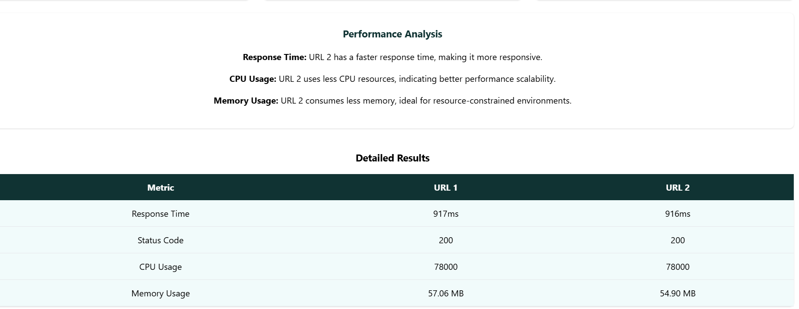

# Análisis Comparativo de Sitios Web

## Descripción del Proyecto

Esta aplicación permite realizar un análisis comparativo entre dos sitios web, evaluando los siguientes aspectos:

- **Response Time**: Tiempo de respuesta de cada sitio.
- **CPU Usage**: Uso de CPU durante la solicitud.
- **Memory Usage**: Uso de memoria durante la solicitud.

Al finalizar el análisis, se presenta un detalle de los resultados, similar al ejemplo siguiente:



## Estructura del Proyecto

El proyecto está dividido en dos partes:

- **Frontend**: Interfaz de usuario desarrollada con **Create React App**.
- **Backend**: Servidor backend implementado con **Node.js**.

## Instalación y Ejecución

### Requisitos Previos

Asegúrate de tener instalado lo siguiente:

- **Node.js** (v16 o superior recomendado)
- **npm** (Incluido con Node.js)

### Instrucciones

#### Frontend
1. Navega a la carpeta `frontend`:
 ```bash
   cd frontend
```

2. Instala las dependencias:
```bash
npm install
```

3. Inicia la aplicación
```bash
npm start
```

4. Abre tu navegador en http://localhost:3000.

#### Backend
1. Navega a la carpeta `backend`
```bash
   cd backend
```

2. Ejecuta el servidor
```bash
node index.js
```

3. El backend estará disponible en [http://localhost:5000](http://localhost:5000) (puerto configurable).

## Tecnologías Utilizadas

- **Frontend**: React.js (Create React App)
- **Backend**: Node.js
- **Librerías Adicionales**:
  - Axios (para solicitudes HTTP)
  - Otros paquetes según las dependencias del proyecto

## Objetivo

Facilitar la comparación de métricas clave entre dos sitios web y proporcionar resultados detallados para evaluar su desempeño.

 
